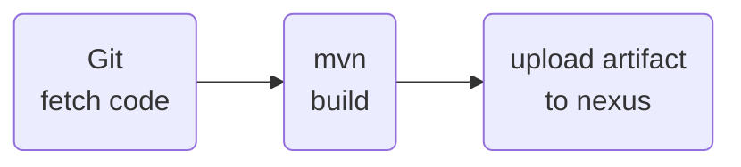

# mise en place d’une CI avec analyse de code, build d’une application, depot dans un registre d’artefact

## Définition du build

## Pré-requis

* Avoir git installé sur sa machine
* Installer maven pour builder en local
* Avoir accès à Jenkins et Nexus


## Exemple de build avec un projet Java

* Sur votre compte Github, forker le code source du projet https://github.com/devopshydclub/vprofile-repo.git, puis cloner le fork en local (adapter l'url à votre fork:
```
git clone https://github.com/vanessakovalsky/vprofile-repo.git myproject
```
* Dans votre IDE, vous avez un fichier pom.xml à la racine du projet, qui est utilisé par l'outil de build maven, et permet de faire le build de l'appli :
* Si on détaille un peu ce fichier :
* * un bloc properties qui définit les propriétés du projet
  * un bloc dependencies qui liste les dépendances nécessaire au fonctionnement de l'application
  * un bloc build qui liste les tâches à faire avant de builder le projet
* Lancer la tache de build avec maven sans lancer les tests pour l'instant :
```
mvn clean install -DskipTests
```
* Vous allez voir les dépendances se télécharger, puis le logiciel se compiler pour pouvoir le lancer

## Automatiser le build depuis Jenkins

### Créer le fichier de pipeline

* A la racine de votre projet, en local ajouter un fichier Jenkinsfile avec le contenu suivant :

```
pipeline {
    agent {
        docker {
            image 'maven:3.9.6-eclipse-temurin-17-alpine' 
            args '-v /root/.m2:/root/.m2' 
        }
    }
    stages {
        stage('Fetch Code') {
            steps {
                git branch: 'vp-rem', url: 'https://github.com/devopshydclub/vprofile-repo.git'
            }
        }
        stage('BUILD') {
            steps {
                sh 'mvn clean install -DskipTests'
            }
            post {
                success {
                    echo 'Now Archiving...'
                    archiveArtifacts artifacts: '**/target/*.war'
                }
            }
        }
  }
}
```
* Ce fichier contient notre pipeline avec les différents éléments nécessaires :
* * La définition de l'agent, dans notre cas l'image de conteneur utilisé par les différentes étapes de notre pipeline
  * Les étapes du pipelines, ici nous avons pour l'instant deux étapes : la récupération du code source et le build de notre application.

### Créer le job sur Jenkins

* Connectez vous à l'interface web de Jenkins
* Sur la page d'accueil de Jenkins, choisir Nouveau Item
* Définir un nom, choisir le type Pipeline et cliquer sur OK
* Dans la page de configuration:
    * Dans Pipeline : 
        * Définition : Choisir `Pipeline Script from SCM`
        * SCM: Git
        * Repository URL : l'URL de votre dépot (la même que pour faire un git clone)
    * Laisser les autres options par défaut (ou modifier les si vous le souhaitez), et cliquer sur `Sauver`
* Lancer un build du job
* Consulter et analyser les logs du build
* Vous devriez alors voir votre build se lancer, et être capable de trouver le paquet war produit par jenkins et maven

## Déposer le build sur Dépôt Nexus

## Configuration (pour tous les environnements)
* Se connecter sur l'UI web de Nexus
* Créer un repository de type Hosted Repository, qui nous servira à déposer nos builds

## Utilisation de nexus sur un projet 
* Nous allons utiliser notre repository pour publier les archives de notre application
* On aura besoin de l'url de nexus, du nom du repository, du groupe, d'un utilisateur et d'un mot de passe de connexion
* Côté Jenkins, on va configurer les identifiants de connexions pour ne pas avoir à les mettre dans le pipeline
* Dans Jenkins - Manage Credentials:
* * Ajouter des credentials de type username and password
  * Entrer le nom d'utilisateur et le mot de pass et renseigner l'id et la description avec nexus-login (c'est l'id que l'on utilise dans le pipeline pour appeler ses credentials)
  * Cliquer sur Save
* Ajouter dans le jenkins file une étape supplémentaire suivante pour envoyer le build sur votre dépot Nexus
```
 stage("UploadArtifact"){
            steps{
                nexusArtifactUploader(
                  nexusVersion: 'nexus3',
                  protocol: 'http',
                  nexusUrl: '172.31.39.229:8081',
                  groupId: 'QA',
                  version: "${env.BUILD_ID}-${env.BUILD_TIMESTAMP}",
                  repository: 'vprofile-repo',
                  credentialsId: 'nexus-login',
                  artifacts: [
                    [artifactId: 'vproapp',
                     classifier: '',
                     file: 'target/vprofile-v2.war',
                     type: 'war']
    ]
 )
            }
```
* Modifier l'URL et le repository pour correspondre à votre environnement et push votre fichier.
* Lancer un nouveau build sur Jenkins
* Vérifier dans nexus que votre archive zip a bien été publiée :)


## Schéma de notre pipeline Jenkins


   

## Pour aller plus loin (si vous avez le temps ou à faire plus tard)
* Un exemple en utilisant gradle et jenkins sur un projet PHP : https://github.com/vanessakovalsky/continuous-integration-training/tree/master 
* Un autre exemple ou l'on build une image docker d'une appli Python : https://github.com/vanessakovalsky/cicd-training 

